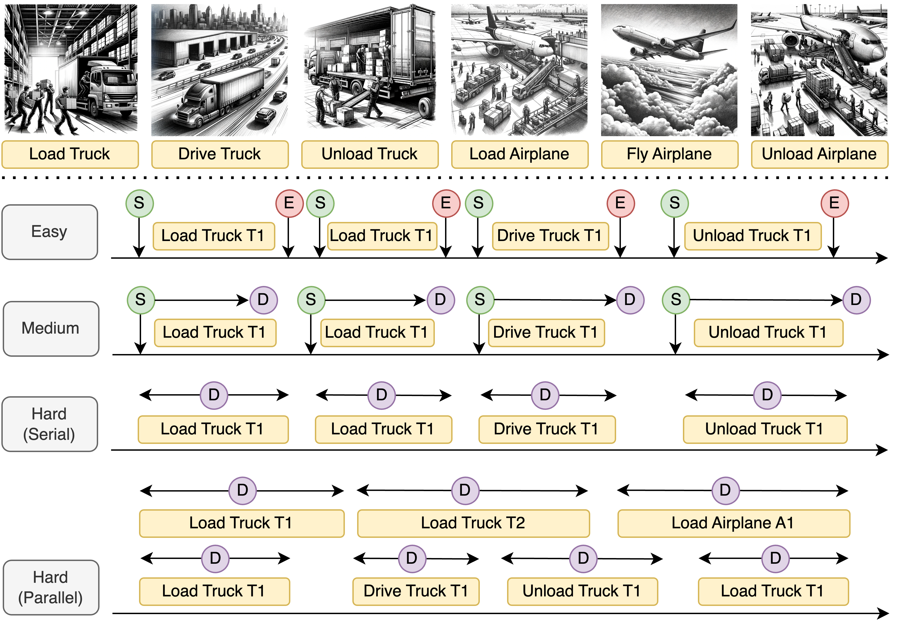

    

# UnSeenTimeQA: Time-Sensitive Question-Answering Beyond LLMs’ Memorization

Check out our paper - [UnSeenTimeQA: Time-Sensitive Question-Answering Beyond LLMs&#39; Memorization](https://arxiv.org/abs/2407.03525)

This paper introduces UnSeenTimeQA, a novel data contamination-free time-sensitive question-answering (TSQA) benchmark. It differs from existing TSQA benchmarks by avoiding web-searchable queries grounded in the real-world. We present a series of time-sensitive event scenarios based on synthetically generated facts. It requires large language models (LLMs) to engage in genuine temporal reasoning without depending on the factual knowledge acquired during the pre-training phase. We designed three types of time-sensitive questions to test LLMs' temporal reasoning abilities over sequential and parallel event occurrences. Our evaluation of five LLMs on synthetic fact-based TSQA reveals mixed results: while they perform well on simpler subsets, their overall performance remains inferior as compared to real-world fact-based TSQA. Error analysis of LLM-generated reasoning chains indicates that LLMs face difficulties in reasoning over long-range event dependencies and parallel event timelines that unfold concurrently.

<p align="center">

</p>

Different types of events (six) from the UnSeenTimeQA benchmark. The benchmark is structured into
four difficulty levels: easy, medium, hard (serial), and hard (parallel). In the easy level, the start (S) and end (E)
times of each event are given. The medium level includes the start time (S) and duration (D) of each event. The hard
(serial) level presents only the duration (D) of events, assuming sequential occurrence. The hard (parallel) level also
includes only durations (D), but events can occur simultaneously. Pictures (top), drawn by DALL-E 3.

## Data Release

Please see `./data` folder to access the UnSeenTimeQA dataset. The JSON files are formatted as below:

### JSON file format for UnSeenTimeQA

```JSON
{
    "id": "int",
    "domain_description": "str",
    "objects_description": "list",   
    "initial_states_description": "list",   
    "events": "list",   
    "question": "list",   
    "answers": "list",   
    "depth": "int",   
    "execution": "str",   
    "question_category": "int",   
    "source_plan_id": "int",   
}
```

### Question Types for UnSeenTimeQA

```JSON
{
    "question_type_1": "Static Time",
    "question_type_2": "Relative Time",
    "question_type_3": "Hypothetical Time", 
}
```

## BibTeX Entry and Citation Info

If you are using our dataset, please cite our paper:

```bibtex
@misc{uddin2024unseentimeqatimesensitivequestionansweringllms,
      title={UnSeenTimeQA: Time-Sensitive Question-Answering Beyond LLMs' Memorization}, 
      author={Md Nayem Uddin and Amir Saeidi and Divij Handa and Agastya Seth and Tran Cao Son and Eduardo Blanco and Steven R. Corman and Chitta Baral},
      year={2024},
      eprint={2407.03525},
      archivePrefix={arXiv},
      primaryClass={cs.CL},
      url={https://arxiv.org/abs/2407.03525}, 
}
```

## Stay tuned for ...

- Huggingface version of UnSeenTimeQA dataset for easy access

## Contact Information

* For help or issues in using UnSeenTimeQA, please submit a GitHub issue.
* Please contact Md Nayem Uddin (muddin11@asu.edu) or Amir Saeidi (ssaeidi1@asu.edu) for communication related to UnSeenTimeQA.
